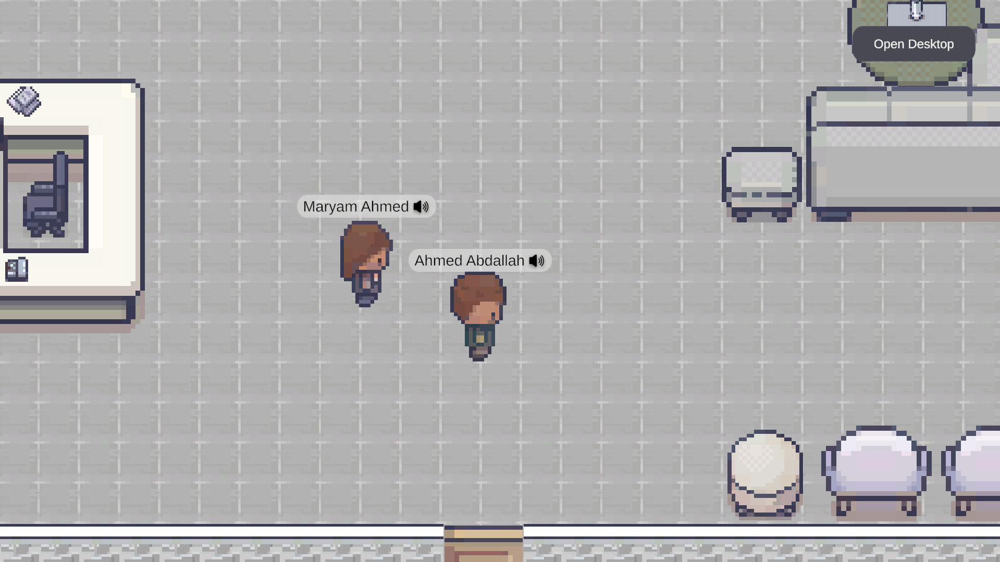
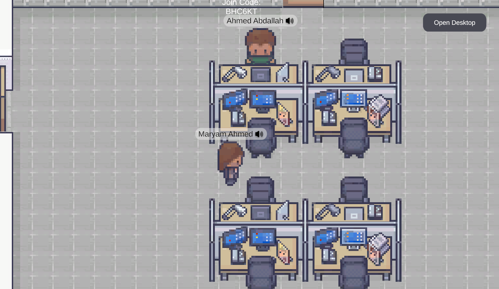
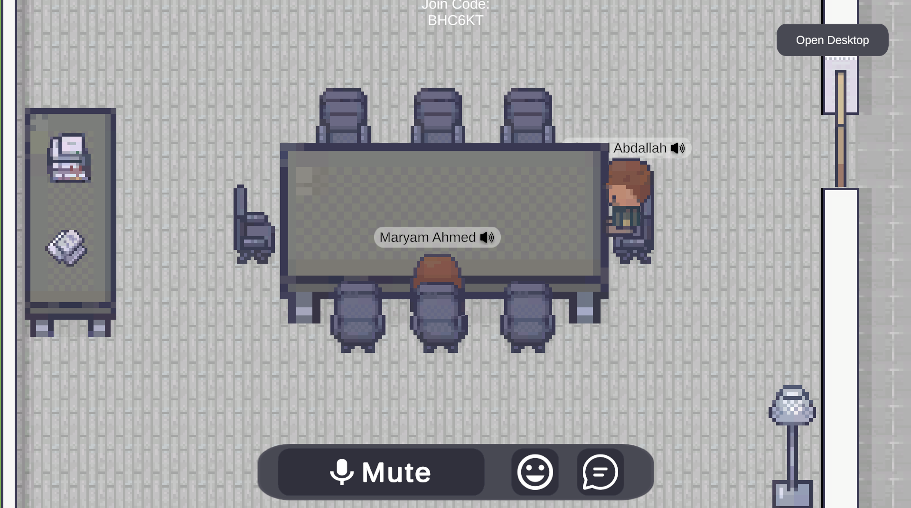
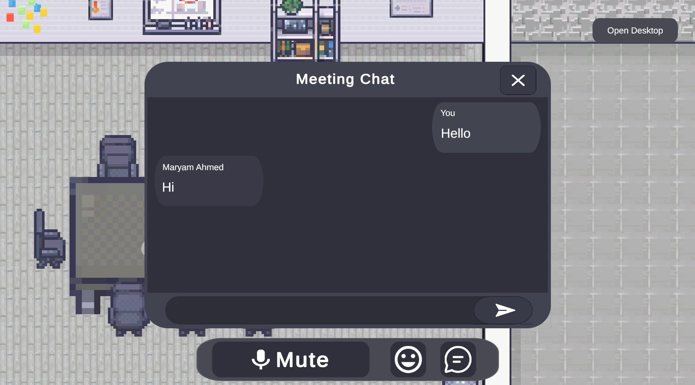
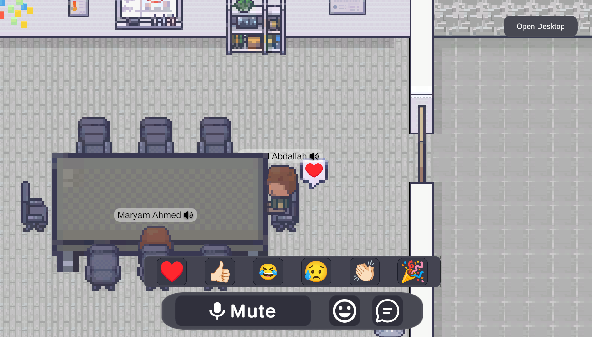
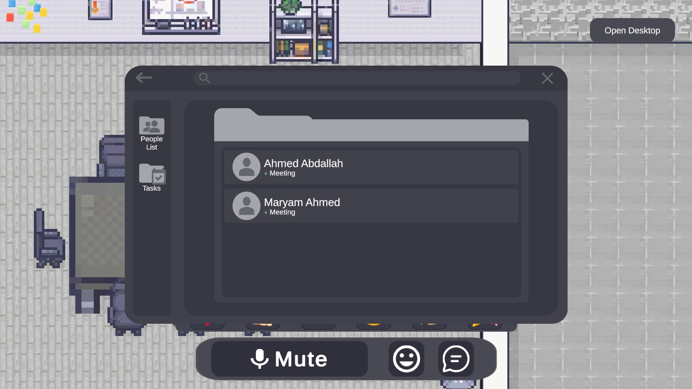
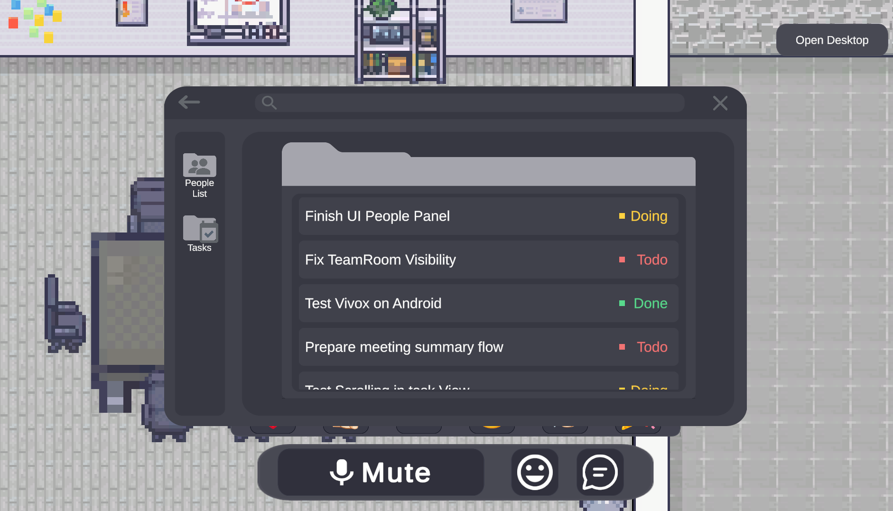
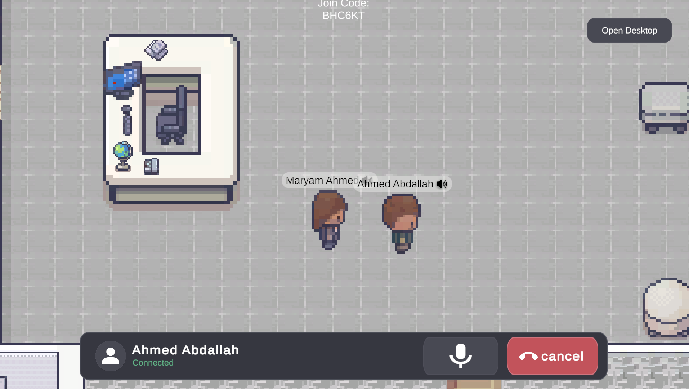

# SyncVerse – Virtual Office

  

A 2D Multiplayer Virtual Office built with Unity, Netcode for GameObjects, Relay, and Vivox.

---

## Overview

**SyncVerse – Virtual Office** is a Unity-based 2D multiplayer virtual workspace designed to provide an interactive environment for remote collaboration. Users can join virtual offices, communicate through voice chat, attend meetings, collaborate with teammates, and navigate different workspaces in real time.

This repository contains the **Unity client** for the Virtual Office.

---
## Table of Contents

- [Overview](#overview)
- [Features](#features)
- [Platform Support](#platform-support)
- [Technologies Used](#technologies-used)
- [Main Modules](#main-modules)
- [Requirements](#requirements)
- [Getting Started](#getting-started)
- [Screenshots](#-screenshots)
- [License](#license)
- [Note](#note)

---

## Features

* Multiplayer virtual office environment
* Real-time player synchronization using Unity Netcode
* Unity Relay integration for online connectivity
* Vivox voice communication
* Lobby and room management
* Meeting Rooms
* Team Rooms with team-based visibility
* Private player interactions
* AI meeting recording integration
* Team-based player visibility
* Private voice calls between players
  
---

## Platform Support

| Platform | Status                        |
| -------- | ----------------------------- |
| Windows  | ✅ Fully Supported             |
| Android  | ✅ Fully Supported             |
| WebGL    | ⚠️ Supported with limitations |

### WebGL Limitations

The application is available on WebGL; however, **Vivox voice communication is currently unavailable** on this platform due to WebGL/browser audio limitations. All other core multiplayer functionalities remain operational.

### Future Improvements

The following features are planned for future releases:

* Additional Break Room activities and mini-games.
* Improved WebGL compatibility as platform support evolves.

---

## Technologies Used

* Unity 2022 LTS
* C#
* Unity Netcode for GameObjects
* Unity Relay
* Unity Transport
* Vivox Voice Chat
* WebSockets (WebGL)
* REST API Integration

---

## Main Modules

### Multiplayer

Responsible for player spawning, synchronization, Relay connection, scene management, and network communication.

### Voice Communication

Uses Vivox to provide real-time voice chat for meetings and room-based communication.

### Room System

Supports different room types:

* Lobby
* Meeting Room
* Team Room
* Break Room

Each room manages visibility, interaction, and player permissions independently.

### AI Integration

AI-powered meeting transcription and summarization integration.

---

## Requirements

* Unity 2022.3 LTS
* Unity Gaming Services (UGS)
* Relay Service
* Vivox Service
* .NET Backend API (optional for AI features)

---

## Getting Started

1. Clone the repository.
2. Open the project using Unity 2022.3 LTS.
3. Configure Unity Gaming Services.
4. Configure Relay and Vivox credentials.
5. Start the backend API.
6. Run the Unity project.

---

## 📸 Screenshots

### Lobby

  

### Team Room

  

### Meeting Room

  

### Meeting Chat

  

### Meeting Reactions

  

### People List

  

### Tasks List

  

### Private Call

  

---

## License

This project is developed as part of a graduation project.

---

## Note

This repository contains **only the Unity Virtual Office client**.

Some features—including authentication, organization management, meeting APIs, AI transcription, AI summarization, and data persistence—depend on the SyncVerse backend services.

If you would like to use the complete system or integrate the Unity client with the backend, please refer to the main project repository:

**Main SyncVerse Repository:**
[https://github.com/syncverse12]

If you are only interested in the Unity multiplayer implementation, this repository can be used independently after configuring the required Unity Gaming Services.
